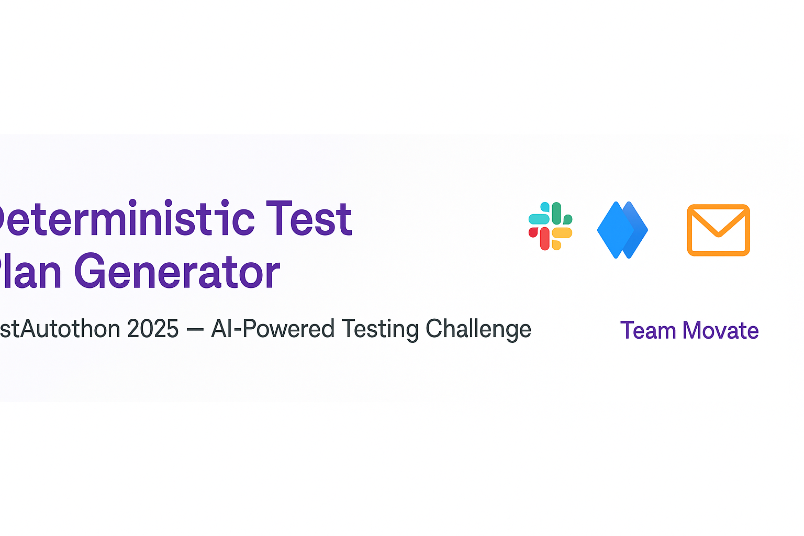
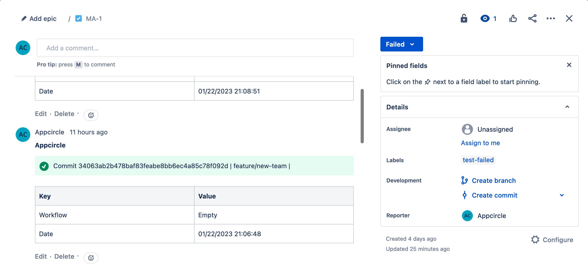

<p align="center">
  
</p>

# 🏆 Deterministic Test Plan Generator
**TestAutothon 2025 — Non-AI Challenge**  
* Theme: *AI-Powered Testing — Orchestrating Automation, Agents & Generative AI for the Future*  
* This solution does **not** use GenAI — it is fully deterministic.

## 📌 Overview

This tool takes a list of failing test incidents (`Failures.jsonl`) and a `Policy.yaml` file and:

- Computes `base_minutes`, `final_minutes`, and `priority_score` for each incident
- Produces a **time-boxed, deterministic test plan** (`plan.json` / `plan.csv`)
- Generates a **sortable dashboard** (`dashboard.html`)
- Sends the results to:
  - 📣 **:contentReference[oaicite:0]{index=0}** (with top tables, file uploads, and links)
  - 📎 **:contentReference[oaicite:1]{index=1}** (attachments + comment on a fixed issue)
  - 📧 **Email distribution list** (HTML tables, embedded download links)

---

## ⚙️ Prerequisites

- :contentReference[oaicite:2]{index=2} v18+  
- npm packages:
  ```bash
  npm install js-yaml nodemailer

📁 Input Files
| File             | Purpose                                                                                              |
| ---------------- | ---------------------------------------------------------------------------------------------------- |
| `Policy.yaml`    | Defines module priorities, multipliers, caps, and layer minutes                                      |
| `Failures.jsonl` | Incident list (JSON Lines). Only uses:<br>`module`, `environment`, `failure_type`, `impacted_layers` |

⚡ Usage
* export SLACK_WEBHOOK_URL="https://hooks.slack.com/services/..."
* node planner.js --policy Policy.yaml --failures Failures.jsonl --out plan.json --dashboard dashboard.html

Generates:
* plan.json — machine-readable plan (use .csv if preferred)
* dashboard.html — interactive summary table

⚡ Output Fields
| Field            | Description                                                                                  |
| ---------------- | -------------------------------------------------------------------------------------------- |
| `base_minutes`   | Sum of minutes per impacted layer (from policy)                                              |
| `final_minutes`  | `base_minutes × environment_multiplier × failure_type_multiplier`, capped and **rounded up** |
| `priority_score` | `module_priority × environment_multiplier × failure_type_multiplier` (rounded to 3 decimals) |

Unknown values:
* Unknown module → priority = 1
* Unknown environment/failure_type → multiplier = 1.0
* Unknown layers → ignored (0 minutes)

📣 Slack Integration
Configure:
* export SLACK_WEBHOOK_URL="https://..."
* export SLACK_CHANNEL_ID="C0123456789"
* export DASHBOARD_URL="https://your-server/dashboard.html"


When run, it will:

Upload the summary table to Slack

Post a message like:

✅ Deterministic Test Plan generated
• Incidents: 53
• Total minutes: 1278

Top 5 by priority:
#  Module                          Env      Mins   Priority
 1. ⚠️ Order Management                 PreProd     58m    7.20
 ...


Also shows a second table: Top 5 by Final Minutes.

📎 Jira Integration

Configure:
* export JIRA_EMAIL="you@company.com"
* export JIRA_TOKEN="your_api_token"
* export JIRA_BASE="https://your-domain.atlassian.net"
* export JIRA_ISSUE_KEY="QAP-123"


Each run will:

* Attach plan.json and dashboard.html to that Jira issue
* Add a new comment with both tables

📌 Policy Calculation Logic

* base_minutes = sum of each layer's minutes
* final_minutes = base_minutes × env_mult × failtype_mult (capped and rounded up)
* priority_score = module_priority × env_mult × failtype_mult

Sorting:
* Primary: priority_score descending
* Secondary: module ascending

📌 Notes

No network calls for calculations — fully deterministic

All integrations (Slack, Jira, Email) are optional and auto-skip if credentials are not set

⚠️ marker highlights incidents with final_minutes > 45 (near cap)


## 📸 Sample Run Screenshots

### 📊 Slack Message (:contentReference[oaicite:1]{index=1})
<p align="center">
  
</p>

### 📎 Jira Comment (:contentReference[oaicite:3]{index=3})
<p align="center">
  
</p>

> ⚠️ These screenshots are for presentation/demo. Your actual visuals may vary depending on your Slack theme, Jira configuration, and email client.
